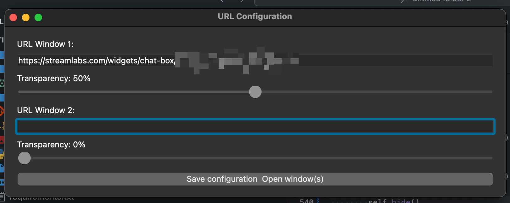
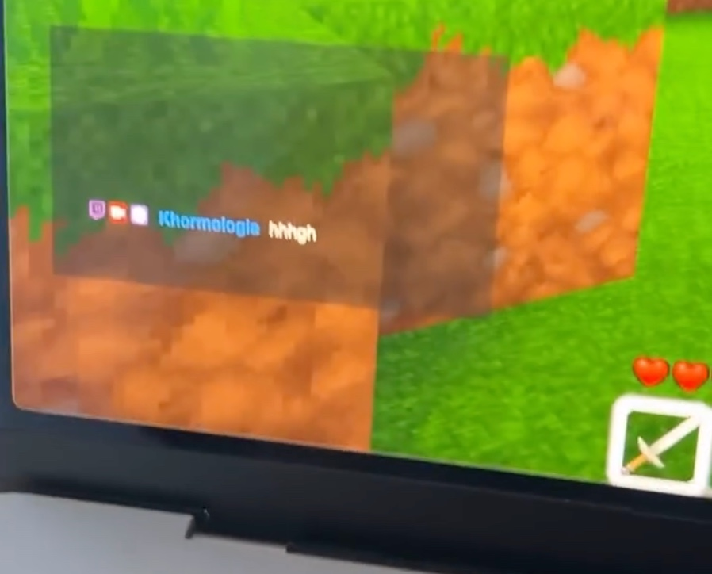

# Installation
To run install python 3.9.x or higher

install requirements via `pip install -r requirements.txt`

To run : run main.py

# Configuration
Connect to streamelments (or any other Bot service) copy the url as you do for OBS and past it in the tool. The custom CSS of your streamelements will be used as well in the service.

Once you click on save and open windows the overlay will be opened and you can game and check your chat

# For Build
To build exe use: `pyinstaller main.py`
